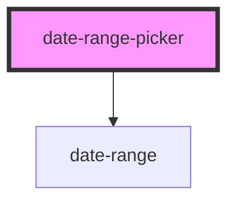

# date-range-picker

<!-- Auto Generated Below -->

## Properties

| Property       | Attribute     | Description | Type                      | Default        |
| -------------- | ------------- | ----------- | ------------------------- | -------------- |
| `dateFormat`   | `date-format` |             | `string`                  | `'yyyy-MM-dd'` |
| `disabledDate` | --            |             | `(date: Date) => boolean` | `() => false`  |

## Events

| Event        | Description | Type                        |
| ------------ | ----------- | --------------------------- |
| `changeDate` |             | `CustomEvent<[Date, Date]>` |

## Dependencies

### Depends on

- [date-range](../date-range)

### Graph

----------------------------------------------

*Built with [StencilJS](https://stenciljs.com/)*
